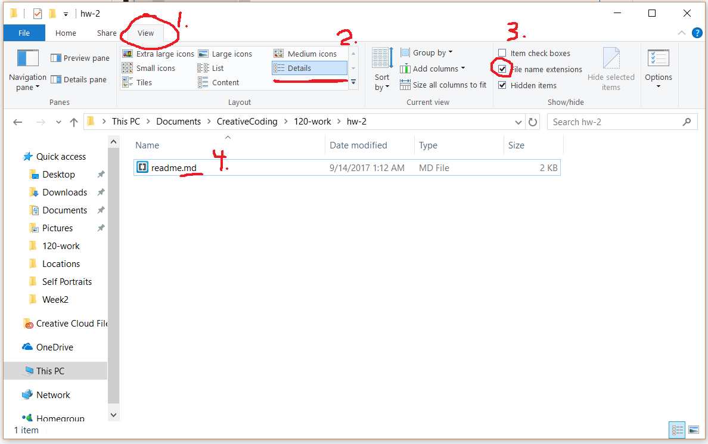
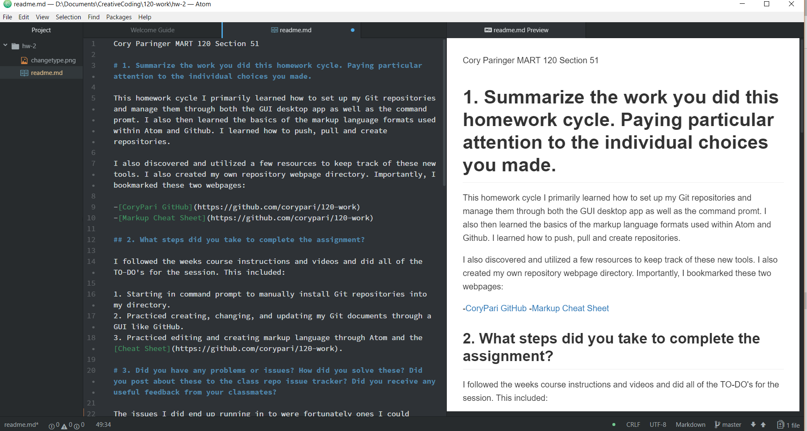

Cory Paringer MART 120 Section 51

# 1. Summarize the work you did this homework cycle. Paying particular attention to the individual choices you made.

This homework cycle I primarily learned how to set up my Git repositories and manage them through both the GUI desktop app as well as the command promt. I also then learned the basics of the markup language formats used within Atom and Github. I learned how to push, pull and create repositories.

I also discovered and utilized a few resources to keep track of these new tools. I also created my own repository webpage directory. Importantly, I bookmarked these two webpages:

-[CoryPari GitHub](https://github.com/corypari/120-work)
-[Markup Cheat Sheet](https://github.com/corypari/120-work)

## 2. What steps did you take to complete the assignment?

I followed the weeks course instructions and videos and did all of the TO-DO's for the session. This included:

1. Starting in command prompt to manually install Git repositories into my directory.
2. Practiced creating, changing, and updating my Git documents through a GUI like GitHub.
3. Practiced editing and creating markup language through Atom and the [Cheat Sheet](https://github.com/corypari/120-work).

# 3. Did you have any problems or issues? How did you solve these? Did you post about these to the class repo issue tracker? Did you receive any useful feedback from your classmates?

The issues I did end up running in to were fortunately ones I could either google to find a result, or were eventually clarified as I read further into the weeks lectures. Primarily, I was initially confused by some of the language used in the command prompt portion of setting up Git. I learned after observation I was not separating some of the command lines properly so the result was neither command would go through.
I also have an issue where the 3 ``` is not functioning as code for me. I can however just paste HTML in the editor and it still functions though.

## 4. Is there anything in particular you learned that you would like to discuss further?

I did not know there was another way to write markup language other than the more common HTML formats I have seen in the past. It is interesting, but also hurts my brain to try to remember a new format. This one seems less fluid to me- while it seems to be much less typing, it is also harder for me to remember that things such as back ticks are a representative of formatting. HTML is much easier to remember, a P is for paragraph.

I also enjoyed learning how Git works in terms of its cloud networking. I can see the advantages of having it be hosted on all of the servers rather than just on one.

# 5. What issues did you help your fellow classmates out with this past homework cycle?

I visited the issues page and helped DMecam with an issue where his GitHub documents will not open in Atom. I work as IT for the University so I tried to offer technical assistance to what students I could tell were having technical issues.

I also created an image walk through for a student who was unable to change the file type for his Windows computer, from .txt to .md. I fortunately know how to fix this issue very consistently so I think the solution I provided to levigoddard will help him greatly!

### Recap, how did I help?

1. Answered numerous Issues in the class repository page.
2. Created images that specifically would asist students who were encountering similar issues.
3. Assisted another classmate in person with understanding of material I had already struggled with previously.

I already heard back from one of the students I assisted that their issue is no longer one!

```html
<body>
<h1>Step instructions for changing file type</h1>

</body>
```


#### SCREENSHOT OF EDITOR


